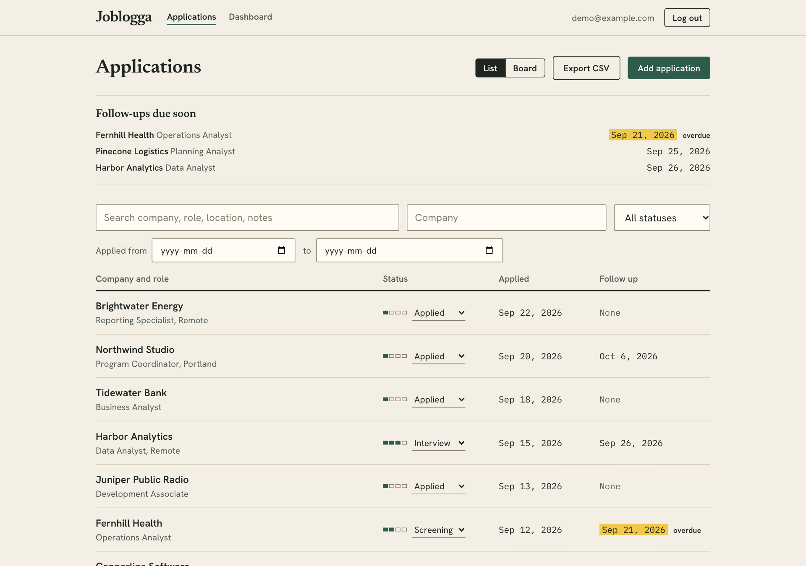
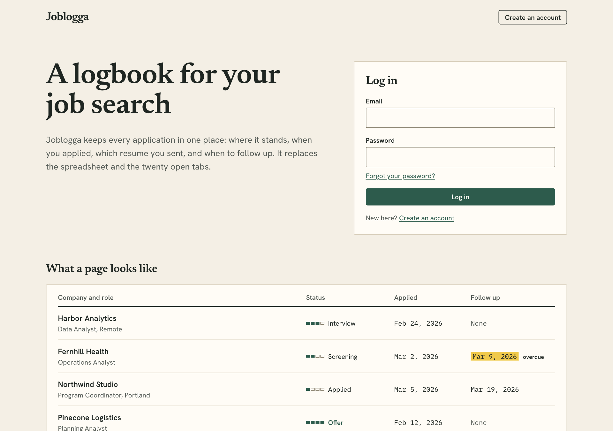
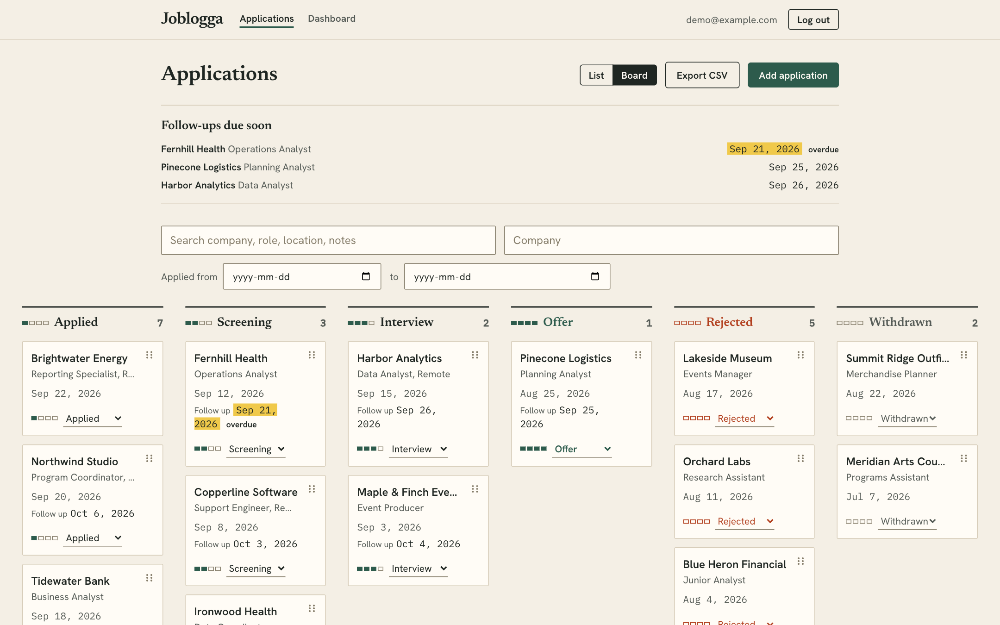
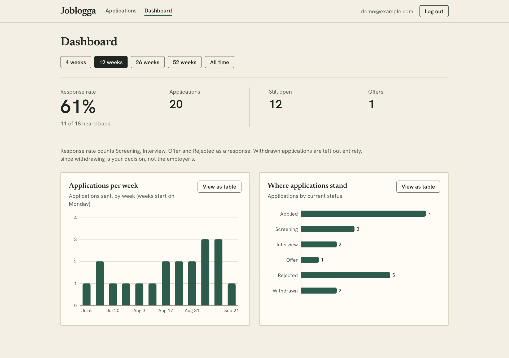

# Joblogga

A multi-user job application tracker: log applications, move them through a status pipeline, set follow-up reminders, and see how your search is going.

**Live at [joblogga.dolocozy.com](https://joblogga.dolocozy.com)**



> **Status: v0.1.0, feature-complete for personal use.** Accounts with password reset, application tracking with status history, follow-up reminders, search and filters, a dashboard, a Kanban board, CSV export and login rate limiting are all built, tested and deployed. See [Known limitations](#known-limitations).

*Screenshots use fictional demo data.*

## Built with Claude Code

This project is built with [Claude Code](https://claude.com/claude-code) as a development tool. I direct the design and review every decision; Claude Code writes much of the code alongside me.

## Tech stack

- **Frontend:** React + TypeScript, Vite, Tailwind CSS, Recharts, `@dnd-kit`, self-hosted fonts (Newsreader, Hanken Grotesk, IBM Plex Mono)
- **Backend:** Python, FastAPI
- **Database:** SQLAlchemy 2.0 with Alembic migrations; PostgreSQL (Neon) in production, SQLite for local development
- **Auth:** JWT (PyJWT) + bcrypt, with password reset by email ([Resend](https://resend.com))
- **Testing / CI:** pytest (run on both SQLite and a real Postgres service); Vitest, Testing Library and MSW; GitHub Actions runs everything on every push
- **Hosting:** Vercel (frontend), Render (API), Neon (database)

## Running locally

**Backend** (http://localhost:8000):

```bash
cd backend
python3 -m venv .venv
source .venv/bin/activate
pip install -r requirements.txt
# create backend/.env with a random SECRET_KEY (see .env.example):
echo "SECRET_KEY=$(python3 -c 'import secrets; print(secrets.token_urlsafe(48))')" > .env
uvicorn app.main:app --reload
```

**Frontend** (http://localhost:5173):

```bash
cd frontend
npm install
npm run dev
```

Open the app, create an account, and you land on your (empty) applications list. The database schema is created and upgraded automatically when the backend starts. See `.env.example` for all settings; to try the password-reset flow without sending email, leave `RESEND_API_KEY` empty and set `LOG_RESET_LINKS=true` so the link is printed in the server log.

**Tests:**

```bash
cd backend && pytest      # API tests (in-memory SQLite; set TEST_DATABASE_URL to run them on Postgres)
cd frontend && npm test  # UI tests (Vitest + Testing Library, API mocked with MSW)
```

## Kanban board

The Applications page has a List/Board toggle. On the board each status is a column, and moving a card between columns changes its status (and is recorded in the status history like any other change). It works with:

- **Mouse:** drag a card (a few pixels of movement starts a drag, so clicking a card still opens it).
- **Touch:** press and hold briefly, then drag, so swiping still scrolls the board.
- **Keyboard and screen readers:** focus a card's grip, press Space to lift, Left/Right to move a column at a time, Space to drop, Escape to cancel. Each step is announced.
- **No dragging at all:** every card has a status dropdown.

A drop moves the card immediately and puts it back with an error if the server refuses. The board loads up to 200 applications at once and notes when there are more; it shares the list's search, company and date filters. Drag-and-drop is built on `@dnd-kit` and loaded only when the board is opened.

## Screenshots

| | |
| --- | --- |
|  |  |
| **Landing page.** What it is, who it is for, and the login, on one page. | **Kanban board.** Drag a card to change its status (mouse, touch or keyboard). |
|  | |
| **Dashboard.** Response rate and charts, each with a table view. | |

## Design

The interface is styled as a logbook: warm paper, dark ink, pine green for actions, brick red for trouble, and a highlighter yellow behind overdue follow-ups. Titles are set in a serif, dates and numbers in a monospace so columns line up like a ledger. The applications list is a ruled ledger with a small stage meter per status, not a stack of cards.

The rules that keep it from looking generic are enforced by a test (`frontend/src/design.test.ts`): no middle-dot separators, no arrows on links, no all-caps tracked labels, no default Tailwind palette colors, two border radii only, and no shadows except the chart tooltip. All text and background pairings were contrast-checked against WCAG.

## Pages

| Path | Who sees it |
| --- | --- |
| `/` | Landing page with the login form (logged in: redirects to `/applications`) |
| `/login`, `/signup` | Stand-alone forms |
| `/forgot-password`, `/reset-password` | Request a reset link by email / choose a new password (open to everyone, logged in or not) |
| `/applications`, `/applications/new`, `/applications/:id` | Your applications, as a ledger list or (`?view=board`) a Kanban board |
| `/dashboard` | Response rate and charts |

Visiting a protected page while logged out sends you to `/`, and logging in returns you to the page you asked for.

Forms validate inline instead of with the browser's native popups. A message appears under a field once you've touched it; for values that are wrong until they are finished (a link, a salary range, a repeated password) it waits until you pause, leave the field, or submit. Email addresses are not format-checked in the browser at all: the server judges them on submit and its message is shown. The server re-checks everything.

## API overview

Interactive docs are at http://localhost:8000/docs when the backend is running.

| Method | Path | Purpose |
| --- | --- | --- |
| POST | `/auth/signup`, `/auth/login` | Create account / get a token |
| GET | `/auth/me` | Current user |
| POST | `/auth/password-reset/request` | Email a reset link (same `202` reply for every address) |
| POST | `/auth/password-reset/confirm` | Set a new password with a reset token |
| GET | `/health` | Liveness check |
| POST | `/applications` | Create (records the initial status) |
| GET | `/applications` | List; filters `status`, `company`, `q`, `date_from`, `date_to`; `limit`/`offset` |
| GET | `/applications/export.csv` | Every application as a CSV file (your backup); includes status history; ignores list filters |
| GET | `/applications/upcoming` | Open applications with a follow-up overdue or due within `days` (default 7) |
| GET / PATCH / DELETE | `/applications/{id}` | Read (with status history) / partial update / delete |
| GET | `/stats` | Dashboard numbers: totals, per-status counts, response rate, weekly series; `weeks=N` limits everything to the last N weeks (omit for all time) |

The CSV neutralizes cells that start with `=`, `+`, `-` or `@` (a leading apostrophe) so a hostile job posting cannot run as a formula when the file is opened in Excel, and starts with a UTF-8 marker so accents open correctly.

Every `/applications` query is scoped to the logged-in user; another user's application returns 404.

## Data model

- `users`: email (unique), bcrypt hash, `session_version` (bumped by a password reset to end earlier sessions).
- `password_reset_tokens`: hash of each reset token, its expiry, and when it was used.
- `applications`: belongs to a user; company, role, job link, date applied, resume version, salary min/max, location, notes, current status, follow-up date.
- `status_changes`: append-only log (`from_status`, `to_status`, timestamp) written whenever an application's status changes, so the full timeline is kept.

## Dashboard

- **Response rate** = applications that ever reached Screening, Interview, Offer or Rejected ÷ all applications except those withdrawn before any response. It reads the status *history*, not just the current status, so Applied → Interview → Withdrawn still counts as answered. A rejection is a response; withdrawing before hearing anything is your decision, so that application is left out of both sides of the ratio. When nothing is eligible the rate is "no data" (shown as a dash), not 0%.
- The status breakdown chart is different on purpose: it shows where each application stands *now*, so that same application appears under Withdrawn there.
- One time-range filter scopes every number and chart, so they always agree. Each chart has a "View as table" twin so no value depends on hovering.
- The charts are loaded on demand, so the login and list pages don't download the charting library.

## Password reset

`/forgot-password` emails a reset link (sent through [Resend](https://resend.com) from `noreply@dolocozy.com`); `/reset-password` lets the person choose a new password.

- **Tokens** are 256 random bits, valid for 30 minutes, and single use. Only a SHA-256 hash is stored, so a copy of the database can't be used to reset anyone's account. Requesting a new link retires the old one. Redeeming is one atomic `UPDATE ... WHERE used_at IS NULL AND expires_at > now`, so two simultaneous uses can't both succeed.
- **No account enumeration:** the request endpoint replies identically, with identical work, whether or not the address has an account. It does no database access before replying; the lookup, the token and the email happen in a background task afterwards, so the response time can't reveal anything either. Rate limits (3 per address and 10 per client address per hour) count every request the same way. Every kind of bad link (unknown, expired, used) gets the same error.
- **The link uses the URL fragment** (`/reset-password#token=...`), which browsers never send to servers or in `Referer` headers, and the page removes it from the address bar and history as soon as it has read it.
- **A reset signs out every existing session.** Login tokens carry a per-user `session_version`; a reset bumps it, so a stolen token stops working. (Tokens issued before the feature existed carry no version and count as 0, so deploying it logged nobody out.)
- **Failures are invisible to the caller:** if sending fails the reply is the same, and the error is logged without the address or the link. Sending retries once, with an idempotency key so a retry can't send two emails.

Setup on Render: add `RESEND_API_KEY` under the service's Environment tab (the domain must be verified in Resend). `FRONTEND_URL` and `EMAIL_FROM` are in `render.yaml`. For local development, leave the key empty and set `LOG_RESET_LINKS=true` to see the link in the server log.

Known limitation: `POST /auth/signup` still answers "Email already registered" for an existing address, which reveals that an account exists. Closing that properly means email verification at signup.

## Rate limiting

Failed logins are limited three ways, and signups and reset requests per address:

| Limit | Allowance | Why |
| --- | --- | --- |
| Per address and account | 5 failures / 15 min | Stops guessing at one account, without letting an attacker lock the real owner out from another address |
| Per account, any address | 20 failures / hour | Stops guessing spread over many addresses |
| Per address, any account | 50 failures / 15 min | Stops one address trying many accounts |
| Signups per address | 10 / hour | Slows account spam |
| Reset requests per account / per address | 3 / hour, 10 / hour | Stops inbox flooding; counted whether or not the account exists |
| Bad reset links per address | 20 / 15 min | There is nothing to guess, but no reason to allow it |

Only failures count, unknown emails count the same as real ones (so the limit reveals nothing), and a locked caller is refused before the password is even checked. Refusals return `429` with a `Retry-After` header and a plain-language message.

Limits are held in the API process's memory: fine for one server, reset on restart, and would move to Redis or the database to run several instances. Knowing each visitor's real address behind a host's proxies is the hard part, and it was measured, not assumed. On Render a request passes Cloudflare and then Render's load balancer, and a forged `X-Forwarded-For` becomes the server's connection address, so that address is never trusted. The API uses `CF-Connecting-IP` (Cloudflare rejects or overwrites a forged one), falls back to counting `X-Forwarded-For` three entries from the right (the left side is written by the client), and if neither works puts everyone in one shared, stricter bucket instead of trusting anything forgeable. Settings: `TRUSTED_CLIENT_IP_HEADER`, `TRUSTED_PROXY_HOPS`.

## Auth design

- **Passwords** are hashed with bcrypt (per-password random salt); plaintext is never stored, and responses never include the hash.
- **Login** returns a short-lived JWT (default 60 min) signed with `SECRET_KEY`, carrying the user's `session_version`. The client sends it as `Authorization: Bearer <token>`.
- **Protected routes** use the `get_current_user` dependency, which verifies the signature and expiry (pinned algorithm) and loads the user. Data routes filter by that user's id, which is how per-user isolation is enforced.
- Wrong email and wrong password return the identical error, and unknown emails still run a bcrypt check, so neither the message nor the response time reveals which emails are registered.
- The frontend keeps the token in `localStorage` and re-validates it against `/auth/me` on load. `localStorage` is readable by page scripts (XSS); an httpOnly cookie would avoid that at the cost of CSRF handling.

## Database migrations

The schema lives in versioned migration files (`backend/alembic/versions`), applied automatically when the API starts.

**Changing the schema:**

```bash
cd backend && source .venv/bin/activate
# 1. edit the model in app/models.py
# 2. generate a migration from the difference, then READ and edit it
alembic revision --autogenerate -m "add priority to applications"
# 3. run the tests: they build the schema from the migrations and fail if it differs from the models
pytest
```

Rules that keep production data safe:

- **Migrations never import app code.** They use plain SQLAlchemy types, so an old migration keeps meaning the same thing however the models change. (Autogenerate writes `app.db.UtcDateTime`; replace it with `sa.DateTime(timezone=True)`.)
- **Autogenerate is a draft.** It cannot see renames (it drops and re-adds) or data changes. Review every file.
- **Make changes backward compatible.** During a deploy the old version keeps serving while the new one migrates, so new columns must be nullable or have defaults, and removing or renaming something takes two releases: add the new thing and deploy, then remove the old thing later.
- **Export your data first** (Export CSV) before a risky change: Neon's free plan only keeps about 6 hours of history.

**How startup behaves:** every start brings the database up to the latest schema: a new database is built from the migrations, and an existing one gets whatever it has not yet applied. The whole upgrade is one transaction with a lock, so a failure on Postgres leaves the database exactly as it was, the app does not start, and the host keeps serving the previous version. On SQLite, migrations switch foreign keys off while a table is rebuilt (so a rebuild can't cascade deletes into child rows) and verify consistency afterwards.

## Deployment

| Piece | Where | Config |
| --- | --- | --- |
| Frontend | Vercel (root directory `frontend`) | `frontend/vercel.json`, env `VITE_API_URL` |
| API | Render web service | `render.yaml` (Blueprint). Secrets set in the dashboard: `DATABASE_URL`, `CORS_ORIGINS`, `RESEND_API_KEY`. `SECRET_KEY` is generated; `FRONTEND_URL`, `EMAIL_FROM` and the proxy settings are in the file |
| Database | Neon Postgres | connection string goes in Render's `DATABASE_URL` |
| Email | Resend | verified sending domain; key in Render's `RESEND_API_KEY` |

Notes:
- The database is on Neon, not Render, because Render's free Postgres expires after 30 days.
- Render deploys only when the GitHub CI checks pass (`autoDeployTrigger: checksPass`).
- Render's free web service sleeps after 15 idle minutes and takes about a minute to wake. The landing page pings the API on load so it is usually awake by the time you log in, and a slow login explains itself.
- CI runs the backend tests on both SQLite and a real Postgres service, since production uses Postgres.
- The database schema is managed with Alembic migrations, applied automatically when the API starts (see [Database migrations](#database-migrations)).

## Known limitations

- **Signup reveals which emails have accounts.** `POST /auth/signup` answers "Email already registered" for an existing address. Password reset does not leak this; closing it for signup would need email verification.
- **Rate limits live in the API process's memory.** Fine for one server (they reset on restart); running several instances would need a shared store.
- **The free hosting tiers sleep.** The first request after a quiet spell can take up to a minute; the landing page pings the API to wake it early.
- **Touch dragging is untested.** The board is configured for touch (a brief press starts a drag, so swiping still scrolls) but has not been tried on a real touch device. Mouse and keyboard dragging were tested in a browser.
- **Login tokens live in `localStorage`** (see Auth design for the trade-off).

## License

MIT
