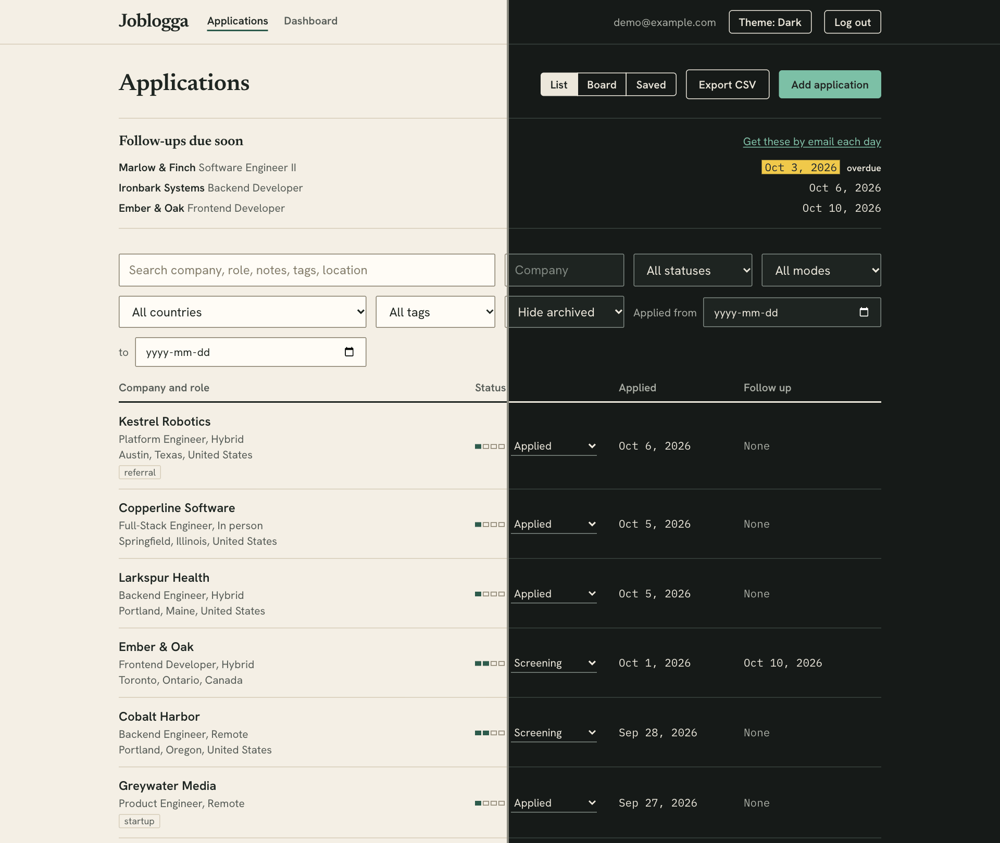
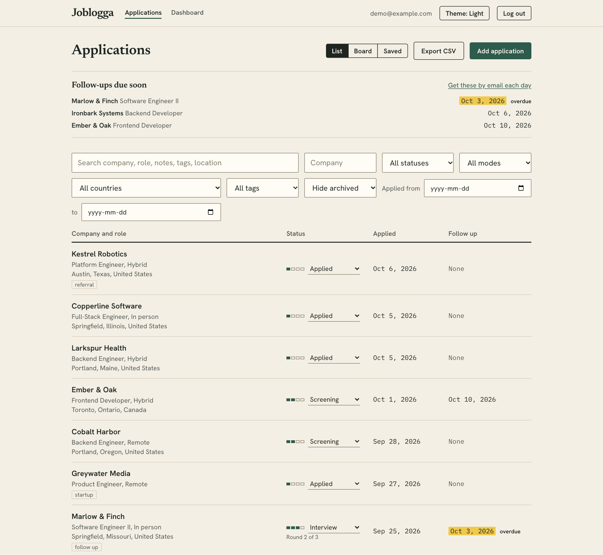
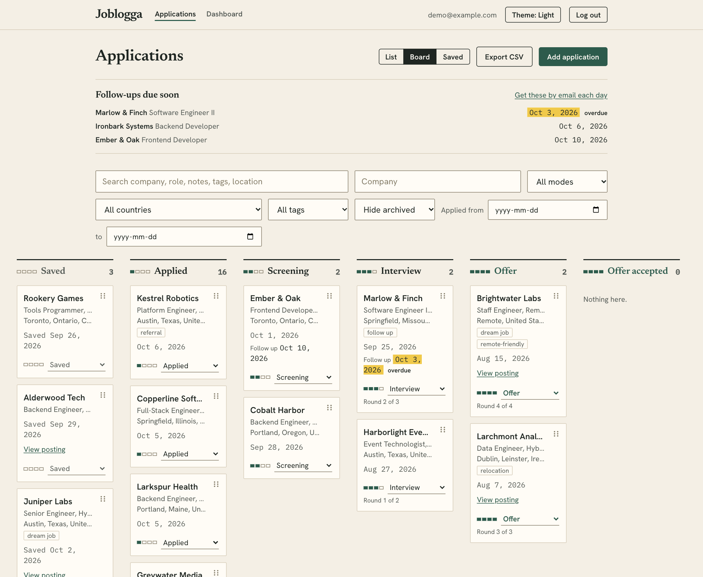
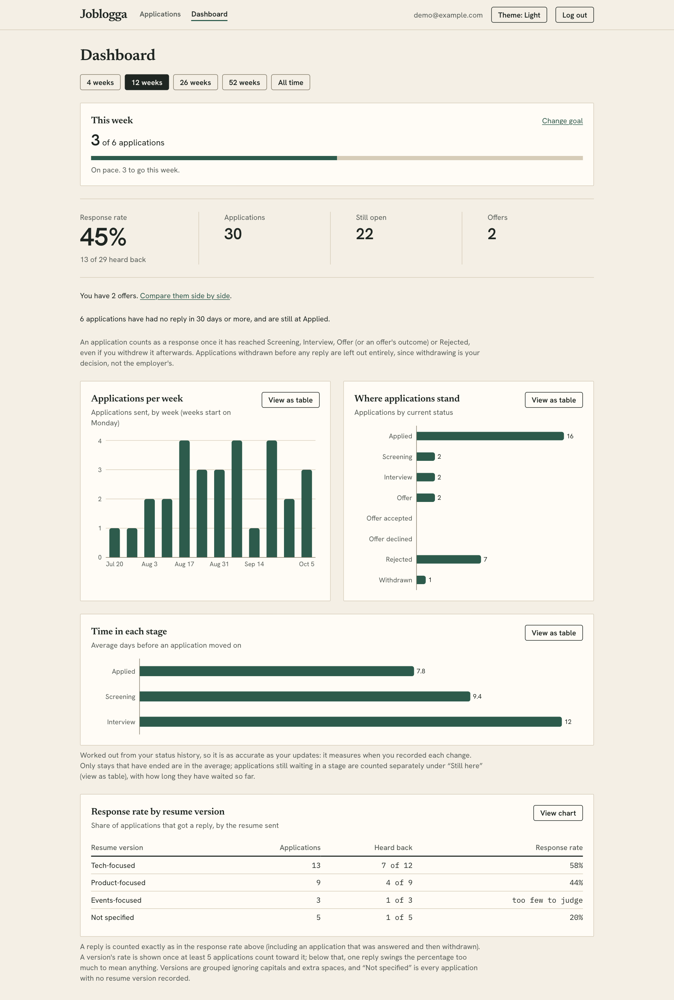
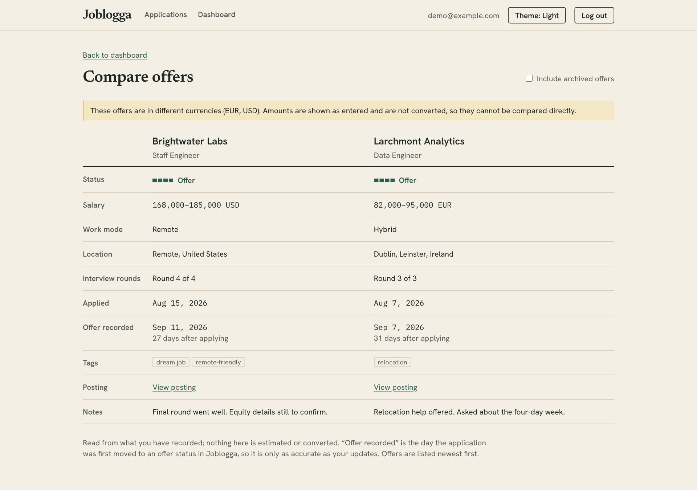
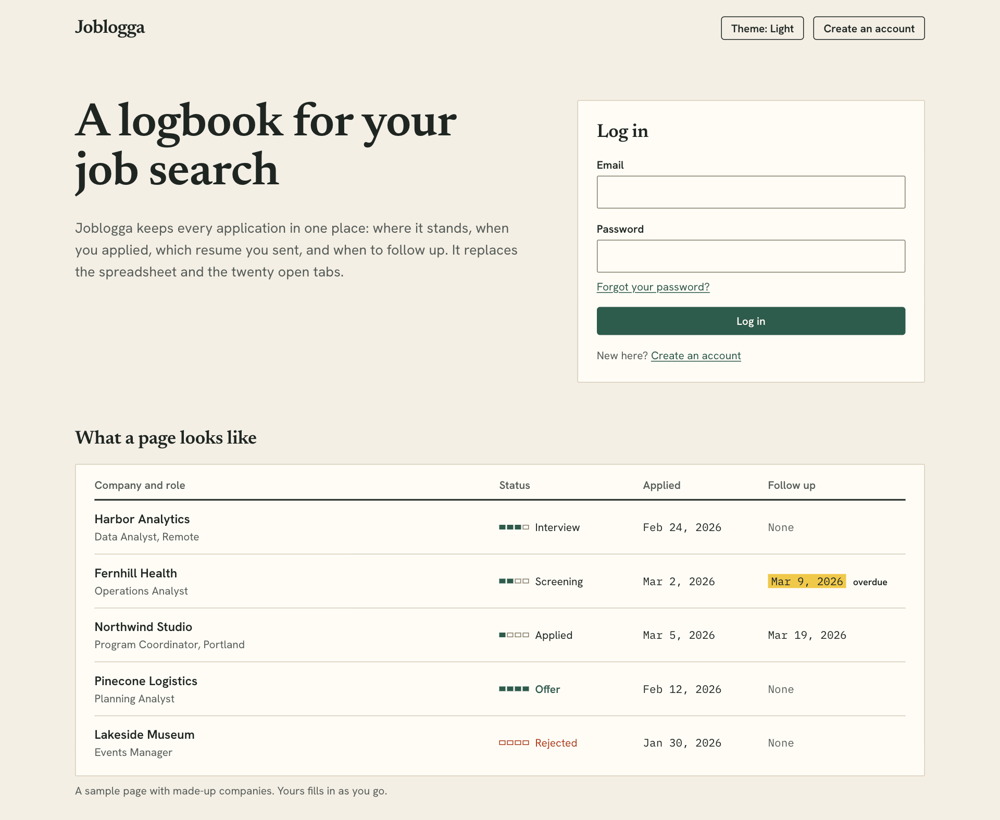

# Joblogga

A multi-user job application tracker: log applications, move them through a status pipeline, set follow-up reminders, and see how your search is going.

**Live at [joblogga.dolocozy.com](https://joblogga.dolocozy.com)**



*Joblogga has a light and a dark theme. It follows your device's setting by default, and a Theme button on every page overrides it. The picture above is one screenshot, light on the left and dark on the right.*

> **Status: v0.1.3, feature-complete for personal use.** Accounts with email verification, password reset and account deletion, application tracking with status history, saved jobs, interview rounds, tags and archiving, real country and city locations, duplicate warnings, CSV export and import, opt-in follow-up reminder emails, search and filters, a dashboard with response rate and time in each stage, a Kanban board and login rate limiting are all built, tested and deployed. See [Known limitations](#known-limitations).

*Every screenshot here uses a demo account with fictional data.*

A public FAQ at `/faq` answers the common questions (what the statuses mean, how the response rate is worked out, reminders, privacy, deleting an account) without needing a login.

## Built with Claude Code

This project is built with [Claude Code](https://claude.com/claude-code) as a development tool. I direct the design and review every decision; Claude Code writes much of the code alongside me.

## Tech stack

- **Frontend:** React + TypeScript, Vite, Tailwind CSS, Recharts, `@dnd-kit`, self-hosted fonts (Newsreader, Hanken Grotesk, IBM Plex Mono)
- **Backend:** Python, FastAPI
- **Database:** SQLAlchemy 2.0 with Alembic migrations; PostgreSQL (Neon) in production, SQLite for local development
- **Auth:** JWT (PyJWT) + bcrypt, with password reset by email ([Resend](https://resend.com))
- **Testing / CI:** pytest (run on both SQLite and a real Postgres service); Vitest, Testing Library and MSW; GitHub Actions runs everything on every push
- **Hosting:** Vercel (frontend), Render (API), Neon (database)

## Running locally

**Backend** (http://localhost:8000):

```bash
cd backend
python3 -m venv .venv
source .venv/bin/activate
pip install -r requirements.txt
# create backend/.env with a random SECRET_KEY (see .env.example):
echo "SECRET_KEY=$(python3 -c 'import secrets; print(secrets.token_urlsafe(48))')" > .env
uvicorn app.main:app --reload
```

**Frontend** (http://localhost:5173):

```bash
cd frontend
npm install
npm run dev
```

Open the app, create an account, and you land on your (empty) applications list. The database schema is created and upgraded automatically when the backend starts. See `.env.example` for all settings; to try the password-reset flow without sending email, leave `RESEND_API_KEY` empty and set `LOG_RESET_LINKS=true` so the link is printed in the server log.

**Tests:**

```bash
cd backend && pytest      # API tests (in-memory SQLite; set TEST_DATABASE_URL to run them on Postgres)
cd frontend && npm test  # UI tests (Vitest + Testing Library, API mocked with MSW)
```

## Kanban board

The Applications page has a List/Board toggle. On the board each status is a column, and moving a card between columns changes its status (and is recorded in the status history like any other change). It works with:

- **Mouse:** drag a card (a few pixels of movement starts a drag, so clicking a card still opens it).
- **Touch:** press and hold briefly, then drag, so swiping still scrolls the board.
- **Keyboard and screen readers:** focus a card's grip, press Space to lift, Left/Right to move a column at a time, Space to drop, Escape to cancel. Each step is announced.
- **No dragging at all:** every card has a status dropdown.

A drop moves the card immediately and puts it back with an error if the server refuses. The board loads up to 200 applications at once and notes when there are more; it shares the list's search, company, work-mode and date filters. Drag-and-drop is built on `@dnd-kit` and loaded only when the board is opened.

## Screenshots

Each picture below is shown in your GitHub theme: the light version if GitHub is light, the dark one if it is dark (where a viewer does not support that, the light one is shown). They come from a demo account with made-up companies, seeded by [`docs/screenshots/seed_demo.py`](docs/screenshots/seed_demo.py), and can be retaken after a release by following the [short note beside it](docs/screenshots/README.md).

**Applications list.** A ruled ledger: the stage reached, the place (a city name used in several states, like Springfield or Portland, is told apart by its state), tags, and follow-ups that are due or overdue rise to the top.

<picture>
  <source media="(prefers-color-scheme: dark)" srcset="docs/screenshots/applications-list-dark.png">
  
</picture>

**Kanban board.** Drag a card to change its status (mouse, touch or keyboard). The board is a strip of columns that scrolls sideways; six are shown here.

<picture>
  <source media="(prefers-color-scheme: dark)" srcset="docs/screenshots/kanban-board-dark.png">
  
</picture>

**Dashboard.** This week against your weekly goal, response rate, applications per week, where applications stand, time spent in each stage, and response rate by resume version. Each chart has a table twin; the resume card is shown as its table here, where a version with too few applications reads "too few to judge" instead of a misleading percentage.

<picture>
  <source media="(prefers-color-scheme: dark)" srcset="docs/screenshots/dashboard-dark.png">
  
</picture>

**Comparing offers.** Offers side by side, with a note when they are in different currencies (nothing is converted).

<picture>
  <source media="(prefers-color-scheme: dark)" srcset="docs/screenshots/offers-dark.png">
  
</picture>

**Landing page.** What it is and who it is for, with the login and a sample logbook page. It looks the same in both themes apart from colour, so there is one picture.



## Design

The interface is styled as a logbook: warm paper, dark ink, pine green for actions, brick red for trouble, and a highlighter yellow behind overdue follow-ups. Titles are set in a serif, dates and numbers in a monospace so columns line up like a ledger. The applications list is a ruled ledger with a small stage meter per status, not a stack of cards.

### Dark mode

A dark theme (the same logbook by lamplight) follows the device's light/dark setting by default and keeps following it, for example at sunset. A **Theme** button in the header of every page, and on the landing and sign-in pages, steps through System, Light and Dark and back round to System, so there is always a way back to following the device; the choice is saved in this browser's `localStorage` only (it is a display preference, not account data, so there is no backend field and it does not follow you between devices). It covers the whole app, the dashboard charts included.

How it works, and why it is not a pile of `dark:` variants: every colour in the app already comes from a handful of design tokens (`frontend/src/index.css`), and the charts read the same tokens, so dark mode is a second set of values for those tokens under `html.dark`, set by `frontend/src/theme.ts`. Nothing can be missed on one screen, because no screen has its own colours. The `dark:` variant is still enabled for anything that ever needs one. A small script in `index.html` applies the saved or system choice before the page paints so a dark-mode reader never sees a flash of light; a test runs that script against the app's own logic so the two cannot drift. The dark palette keeps the light one's standard (text 4.5:1 or better, control borders 3:1), checked by a test that reads the stylesheet, which also fails if a colour is added without a dark value or a chart hard-codes one. One exception is deliberate: text on the solid yellow highlight stays dark in both themes (a token of its own), since the ink colour turns light in dark mode.

The rules that keep it from looking generic are enforced by a test (`frontend/src/design.test.ts`): no middle-dot separators, no arrows on links, no all-caps tracked labels, no default Tailwind palette colors, two border radii only, and no shadows except the chart tooltip. All text and background pairings were contrast-checked against WCAG.

## Pages

| Path | Who sees it |
| --- | --- |
| `/` | Landing page with the login form (logged in: redirects to `/applications`) |
| `/login`, `/signup` | Stand-alone forms |
| `/forgot-password`, `/reset-password` | Request a reset link by email / choose a new password (open to everyone, logged in or not) |
| `/verify-email` | Where the verification link in the signup email lands (open to everyone) |
| `/faq` | Frequently asked questions, in plain language (open to everyone, logged in or not) |
| `/account` | Who you are, email reminders, the weekly goal, CSV export and import, and deleting your account |
| `/applications`, `/applications/new`, `/applications/:id` | Your applications, as a ledger list, a Kanban board (`?view=board`), or the jobs you have saved but not applied to (`?view=saved`) |
| `/dashboard` | Response rate and charts |
| `/offers` | Your offers side by side (linked from the dashboard once you have two) |

Visiting a protected page while logged out sends you to `/`, and logging in returns you to the page you asked for.

Forms validate inline instead of with the browser's native popups. A message appears under a field once you've touched it; for values that are wrong until they are finished (a link, a salary range, a repeated password) it waits until you pause, leave the field, or submit. Email addresses are not format-checked in the browser at all: the server judges them on submit and its message is shown. The server re-checks everything.

## API overview

Interactive docs are at http://localhost:8000/docs when the backend is running.

| Method | Path | Purpose |
| --- | --- | --- |
| POST | `/auth/signup` | Start an account: the same `202` reply for every address; a verification email follows |
| POST | `/auth/login` | Get a token (unverified accounts can log in) |
| GET | `/auth/me` | Current user, including `email_verified`, `reminder_emails` and `weekly_goal` |
| PATCH | `/auth/me` | Change your settings, only the ones you send: `reminder_emails` (a real boolean) switches the daily follow-up email on or off; `weekly_goal` (a whole number from 1 to 100, or `null` to remove it) sets the weekly application goal |
| POST | `/auth/unsubscribe-reminders` | Switch reminders off from the link in an email (a signed token; no login) |
| POST | `/auth/verify-email/confirm` | Redeem a verification token (no login needed) |
| POST | `/auth/verify-email/resend` | Email the logged-in user a fresh verification link |
| POST | `/internal/send-follow-up-reminders` | Not for people, and hidden from the docs: the daily job's trigger, authenticated by the `X-Reminder-Secret` header |
| POST | `/auth/delete-account` | Permanently delete the account and all its data; needs the password again |
| POST | `/auth/password-reset/request` | Email a reset link (same `202` reply for every address) |
| POST | `/auth/password-reset/confirm` | Set a new password with a reset token |
| GET | `/health` | Liveness check |
| POST | `/applications` | Create (records the initial status) |
| GET | `/applications` | List; filters `status`, `work_mode` (either can repeat), `archived` (`hide` by default, `include`, `only`), `tag` (repeat to require several), `country_id`, `state_id`, `company`, `q` (search words, see Search), `date_from`, `date_to`; `limit`/`offset` |
| GET | `/geo/countries`, `/geo/states?country_id=`, `/geo/cities?country_id=&q=` | The place picker's lookups, read from our own database (login required) |
| GET | `/applications/export.csv` | Every application as a CSV file (your backup); includes status history; ignores list filters |
| POST | `/applications/import` | Import a CSV (sent as `text/csv`; `skip_duplicates`, default true). Adds what it can and returns what it added, skipped and changed |
| POST / PATCH / DELETE | `/applications/{id}/contacts[/{contact_id}]` | Add, change or remove a contact (the detail response lists them) |
| GET | `/applications/offers` | Applications at an offer stage, newest first, with `offer_recorded_on` and `days_to_offer` (worked out from the history); `archived` as for the list |
| GET | `/currencies` | The currency codes a salary can be in, with names (common ones first) |
| GET | `/applications/tags` | Every tag you have used, with how many applications carry it |
| GET | `/applications/duplicates` | Other applications with the same company and role (`company`, `role`, optional `exclude_id`), for the duplicate warning |
| GET | `/applications/upcoming` | Open applications with a follow-up overdue or due within `days` (default 7) |
| GET / PATCH / DELETE | `/applications/{id}` | Read (with status history) / partial update / delete |
| GET | `/stats` | Dashboard numbers: totals, per-status counts, response rate, weekly series, and `goal` (this week against your weekly goal, `null` when you have none); `weeks=N` limits everything to the last N weeks (omit for all time) |

The CSV neutralizes cells that start with `=`, `+`, `-` or `@` (a leading apostrophe) so a hostile job posting cannot run as a formula when the file is opened in Excel, and starts with a UTF-8 marker so accents open correctly.

Every `/applications` query is scoped to the logged-in user; another user's application returns 404.

## Data model

- `users`: email (unique), bcrypt hash, `email_verified_at` (empty until verified), `reminder_emails` (off until switched on) and `reminder_last_sent_on`, `session_version` (random at signup; bumped by a password reset to end earlier sessions).
- `countries`, `states`, `cities`: the place data (see Places), loaded once by a migration. Their ids are the dataset's own.
- `application_contacts`: the people you have dealt with at a company, per application (name, title, email, LinkedIn link). Removed with the application.
- `application_tags`: one row per application and tag, tags stored normalised (see Tags). Removed with the application.
- `password_reset_tokens`, `email_verification_tokens`: hash of each token, its expiry, and when it was used.
- `applications`: belongs to a user; company, role, job link, date applied (empty while Saved), resume version, salary min/max with `salary_currency`, location (readable text) with `country_id` and `city_id` pointing at the place tables, work mode (remote, hybrid or in person; empty means not specified), `archived_at` (empty unless archived), interview round and total rounds (optional, e.g. round 2 of 3; kept as a record after the application moves on, and with no effect on status or any statistic), notes, current status, follow-up date.
- `users.weekly_goal`: an optional number of applications to send each week; empty for everyone until they set one (see Dashboard).
- `status_changes`: append-only log (`from_status`, `to_status`, timestamp) written whenever an application's status changes, so the full timeline is kept.

## Places

The location field is a country and a city picked from real data, with a way to type a place that is missing.

- **Data:** the [countries-states-cities database](https://github.com/dr5hn/countries-states-cities-database) (ODbL 1.0): 250 countries and territories, 5,308 states and provinces and 152,970 cities. It is vendored, unmodified and pinned to one upstream version with checksums, in `backend/data/geo` (about 5.4 MB, with its license and a NOTICE). Migration `0008` loads it once; every lookup afterwards reads our own tables, so there is no API key, rate limit, network dependency or ongoing cost. Adding the database took about 15 MB.
- **A picked city is a specific row, not text.** Many names repeat (twenty Springfields in the US alone), so the list shows each match with its state ("Springfield, Illinois"), and choosing one stores that city's id. Its state and country come with it, so there is no state box; the readable place ("Springfield, Illinois, United States") is generated on the server, never trusted from the client, and shown wherever a location appears, including the CSV.
- **Typed places** are still allowed, alongside a country if you like. The form says a typed place has no structure, so two places with the same name can look identical.
- **Existing locations were not touched.** `location` keeps its column and every value; the migration adds nullable `country_id` and `city_id` and does not try to parse old text into places, which would risk silently corrupting real data. Re-pick a place on an application if you want the structure.
- **Search** matches from the start of a name, ignoring case and accents (`zurich` finds Zürich), biggest places first, using a normalised `search_name` column and a plain index that works the same on Postgres and SQLite. Keyword search on the applications list also matches cities, states and country names.
- **Filters:** by country, and by state or province once a country is chosen. Applications with a typed place have no country or state to filter by.
- **Export:** the `Location` column stays (now with the state and country for a picked place), and `Country`, `State` and `City` columns are added.
- **Tests** run against a tiny stand-in dataset (with duplicate names on purpose) so the suite stays fast; one file checks the real files' checksums and row counts and loads them through the migration on both databases.

Place data: countries-states-cities-database, ODbL v1.0, credited on the landing page. The data files stay under the ODbL; the rest of the repository is MIT.

## Comparing offers

`/offers` puts applications at **Offer**, **Offer accepted** or **Offer declined** side by side (a past offer can still be worth weighing against a new one): a column per offer, a row per thing worth deciding on. The dashboard links to it once you have two or more.

- **Up to four at once.** A column per offer stops being readable past a handful, so with more than four you tick which to compare (the newest four to start). Columns scroll sideways on a narrow screen, with the row labels staying put. Archived offers are left out unless you tick "Include archived offers".
- **Rows:** status, salary with its currency, work mode, location, interview rounds, applied date, when the offer was recorded and how many days after applying that was, tags, the posting link, and the notes in full. A value that was never recorded says "Not recorded" rather than showing a blank or a zero.
- **No conversion.** If the offers are in different currencies it says so and that the amounts are shown as entered and cannot be compared directly.
- **Read-only, and derived.** Nothing here is stored for the view. The one thing the list could not already give, how long the offer took, is worked out by the endpoint from the status history (the first time the application reached any offer status) rather than adding a column. "Recorded" is meant literally: it is when the change was entered, so it is only as accurate as your updates (an application entered straight at the Offer stage shows the day it was entered).

## Salary currency

Salaries are recorded in a currency, because once locations went global a `120000` could be dollars or euros and nothing said which. Each application has a `salary_currency` (an ISO 4217 code, `USD` by default), chosen next to the amounts on the form and shown beside them on the detail page as `110,000–130,000 USD`, with the code after the number rather than a symbol before it (`$` is a dozen currencies).

- **Record-keeping only.** There is no conversion and no exchange-rate service: a code is stored and shown, and amounts are never changed or compared across currencies.
- **A list in code, not a table.** The valid codes (`backend/app/currencies.py`, served at `/currencies` so the form and server share one list) were generated from the currency columns of the bundled places data and then corrected where that data is behind or not ISO: Antarctica's `AAD` is removed, and `SLE` and `ZWG` are added (the retired `SLL` and `ZWL` stay valid, since an old salary may be in them). A test ties the list to the data, so refreshing the data without updating the list fails the build. `usd` is tidied to `USD`, and anything that is not a real code, such as `USS`, is refused rather than stored.
- **Existing applications became `USD`** in the migration that added the column, rather than being left empty: the app had no currency before, was used in the US, and the places data is only days older. Nothing is inferred from an application's place, which would be a guess presented as data. A salary in another currency is a one-field change.
- **CSV:** a `Salary currency` column in the export, read back by the import. A file with a salary but no currency (or an unrecognised one) is imported as `USD` and says so in the result, rather than guessing.

## Contacts

Who you have actually talked to at a company: recruiter, hiring manager, referral. An application can have up to 10 contacts, each a name (required) plus an optional role or title (free text, since titles vary too much for a list), email and LinkedIn link.

- **Detail page only.** They are detail, not at-a-glance like tags or work mode, so they appear on the detail page and not in the list or board. Each add, edit and remove is saved on its own straight away (the application form does not carry them), so adding a contact never disturbs what you are typing in the form.
- **Validation** follows the rest of the app: the server judges an email address (its own message is shown), the LinkedIn link must be `http(s)`, and links are only rendered if they are safe.
- **CSV:** one `Contacts` column, one contact per line as `Name | Title | email | LinkedIn link` (empty fields kept in place). A name-and-role summary would have dropped emails and links from what is also your backup, and the import promises a round trip, so every field is written and the import reads it back (an invalid email or link is left empty and reported, a contact with no name is skipped and reported). The price: those four fields cannot contain a pipe or a line break.

## Tags

Free-form labels for your own prioritising ("referral", "dream job", "backup option"), separate from status. An application can have up to 10, each up to 30 characters.

- **Free-form, but normalised so they cannot fragment.** Tags are saved in lower case with runs of spaces collapsed, so "Dream Job", "dream  job" and " dream job " are one tag. That gets the consistency of a fixed list with the freedom of free text; the price is that tags display in lower case. A tag cannot contain a comma or semicolon (those separate tags when typing, and in the CSV). The same normalising is done in the browser, the API, the CSV import and the filter, in one place each, so the box never shows something the server then changes.
- **In the app.** Small quiet labels on list rows, board cards and the detail page (the first three, then "+2"); on the edit form, chips with a box that adds on Enter or a comma, removes the last on Backspace, adds a half-typed tag when you click away, and suggests tags you have used before. The list and board have a tag filter (with counts), and keyword search matches tags too.
- **Filtering** is by whole tag, and several tags in the API must all be present. Matching is case- and spacing-insensitive.
- **Stored in their own table**, one row per application and tag, rather than an array or JSON column, because that works the same on SQLite and Postgres and filters and counts with plain SQL.
- **CSV:** a `Tags` column, `a; b; c`, which the import reads back (it also accepts commas, and a `Labels` header).

## Follow-up reminders

An opt-in email, once a day, listing your open applications whose follow-up date is today or has passed. **It is off for everyone until switched on** (Account page, "Email reminders"; the follow-ups panel links there while it is off). Existing accounts were not switched on by the deploy.

- **What is sent:** one digest per person per day, however many things are due (up to 20 listed, the rest counted), only when something is due. Overdue ones keep appearing each day until the date is changed or the application is closed, which is what a reminder is for. Closed and archived applications are left out; a saved job's follow-up date counts as its "apply by" date. Each email has an unsubscribe link that works without logging in, and a `List-Unsubscribe` header so mail programs can show their own button.
- **Only verified addresses.** An opted-in but unverified address is counted in the run's report and never emailed.
- **Exactly once a day.** Each person's day is claimed in one `UPDATE` before the email is sent, so a retry or a double-fired run cannot send twice (tested against concurrent runs on Postgres). If sending fails the claim is released, so the next run tries again.
- **"Today" is the UTC date** at send time; there are no per-user time zones yet.

**How it is triggered.** Render's free plan has no cron jobs or background workers, and the free web service sleeps, so nothing inside the API can wake up on a schedule. A GitHub Actions workflow (`.github/workflows/follow-up-reminders.yml`, daily at 13:07 UTC, also runnable by hand from the Actions tab) runs `.github/scripts/send-follow-up-reminders.sh`, which POSTs to `/internal/send-follow-up-reminders` with a shared secret. The script waits for a sleeping API to wake (it retries the errors a waking service gives), calls again while people remain, and exits non-zero if anything failed, so GitHub marks the run failed and emails the repository owner. The endpoint compares the secret in constant time, rate limits wrong guesses, refuses to run if no secret or no email key is configured (so a missing key can never use up a day's digests), and is a no-op when called twice.

**Setting it up** (once):

1. Generate a secret of at least 32 characters: `openssl rand -hex 32`.
2. Put it in Render as `REMINDER_SECRET` (service, Environment). Until it is set, the endpoint answers 503.
3. Put the same value in GitHub as a repository secret named `REMINDER_SECRET` (Settings, Secrets and variables, Actions). If the API is not at `https://joblogga-api.onrender.com`, also set a repository variable `API_URL`.
4. Run the workflow once by hand from the Actions tab to check it ("Send today's digests"). Its log shows `sent`, `failed`, `skipped_unverified` and `remaining`.

**Limits to know about.** GitHub disables scheduled workflows in a public repository after 60 days with no repository activity, with no warning, so if development stops the reminders silently stop (re-enable the workflow from the Actions tab). Scheduled runs can also be delayed, and occasionally dropped, when GitHub is busy; the schedule is deliberately off the hour for that reason.

## Search

One search box above the list, board and saved view looks in the company, role, notes, tags and location (city, state or country) at once, ignoring case. It is **one more filter, layered on the others**: searching "google" while the status filter says Interview shows Google applications at Interview, and clearing the search leaves the status filter alone. **Every word must be found, each in any field**, so "acme backend" finds the Backend Engineer role at Acme although the words are in different fields (it used to match only one contiguous phrase inside a single field, which made two-word searches miss). Words match parts of words, and `%` and `_` mean themselves. Nothing found is an ordinary empty result, not an error. Archived applications stay hidden unless the archive filter includes them, searching or not. Search is a database substring match, which is right for a personal logbook of hundreds of rows; it is not ranked and not typo-tolerant, and would be swapped for Postgres full-text search before it had to serve much more.

## Archive

Archiving puts an application away without deleting it, so the active list stays focused on what is still going on. It is manual (a button; no automatic suggestions yet): **Archive** on the detail page for any application, and a one-click **Archive** on a list row once the application is closed (rejected, withdrawn, offer declined or accepted). **Unarchive** brings it back.

- **A view preference, not a deletion.** Archived applications are hidden from the default list and board and from the follow-up reminders, and reachable with the "Archived applications" filter (hide, include, or only archived). They still count in every dashboard figure, so archiving never quietly changes your historical response rate or totals, and they are in the CSV export (with the day archived in an `Archived` column, which the import reads back) and in the duplicate check.
- **Nothing else clears it.** Changing the status, editing any field, or moving a card leaves an archived application archived; only an explicit unarchive does. `archived_at` records when, and archiving twice keeps the first time.
- **Delete is separate.** `DELETE /applications/{id}` is still the real, permanent delete.

## CSV import

The Account page can import a CSV: the reverse of the export, so exporting and then importing into a fresh account reproduces every application (fields, picked places, status history), which is how it is tested. Spreadsheets from elsewhere work if the first row names the columns: `Company` and `Role` are required, anything else is optional, and common spellings are recognised ("Employer", "Job title", "Applied", "URL"...). Comma, semicolon and tab separators, and UTF-8 or Windows-1252, are all read.

The rule is "import what can be imported, and say exactly what was not". The result lists:

- **Skipped:** rows with no company or no role, or a value the database would refuse (with the reason and the row number as a spreadsheet shows it).
- **Left out as duplicates:** a row with the same company and role (the duplicate-warning rules: case and spacing ignored, nothing fuzzier) as an application you already have, or as an earlier row of the file. Importing the same file twice therefore adds nothing. Untick the box to keep duplicates.
- **Adjusted values:** a date that is not `YYYY-MM-DD` (`3/4/2026` could be March or April, so it is not guessed), a salary that is not a number, an unknown work mode or status, a link that is not `http(s)`, rounds out of range. The value is left empty (an unknown status becomes Applied) and the row is still imported. A row with no usable applied date is dated today, as adding one by hand without a date is, and that is reported, because it will count as applied today.
- Blank rows are ignored.

Country, State and City are matched back to the place data by name (the country also by code), so an exported file restores the exact city; a city that is ambiguous without its state, or a place that is not in the data, stays as typed text rather than being guessed. The apostrophe the export puts before text beginning with `=`, `+`, `-` or `@` (to stop a spreadsheet running it as a formula) is taken off again. A `Status history` column in the export's format is rebuilt into dated status changes if it ends at the row's status, which keeps the time-in-stage figures meaningful; otherwise the row starts from its status. Limits: 1,000 rows and 2 MB per file. The import is one transaction.

## Duplicate warning

Saving an application whose company and role match one you already have (ignoring case and extra spaces, nothing fuzzier, so "Data Analyst" and "Senior Data Analyst" are different) shows a warning with a link to the existing one and asks "Add anyway?". It never blocks: applying twice can be legitimate. When editing, it only asks if the company or role was actually changed, so saving notes on an application that has a twin does not nag. If the check cannot be made, the save goes ahead. Saved jobs and closed applications count as matches. The comparison is done in Python, because SQL's `lower()` only understands ASCII on SQLite.

## Dashboard

- **Response rate** = applications that ever reached Screening, Interview, Offer (or an offer's outcome) or Rejected ÷ all applications except those withdrawn before any response. It reads the status *history*, not just the current status, so Applied → Interview → Withdrawn still counts as answered. A rejection is a response; withdrawing before hearing anything is your decision, so that application is left out of both sides of the ratio. When nothing is eligible the rate is "no data" (shown as a dash), not 0%.
- **Statuses:** Saved (a job you have not applied to yet), Applied, Screening, Interview, Offer, then the endings Offer accepted, Offer declined, Rejected and Withdrawn. Declining an offer is your decision, so it is not filed as a rejection. "Ghosted" is not a status because nothing happens to record; the dashboard instead counts applications still at Applied after 30 days. Saved jobs have no applied date and are left out of every figure here (total, response rate, weekly chart, no-reply count) until you mark them applied. The reasoning is in [docs/status-audit.md](docs/status-audit.md).
- **Time in each stage** (Applied, Screening, Interview, Offer) is worked out from the status history: a stay is the time between entering a stage and the next change. The card shows the average and median days (with a table twin) over stays that have **ended**. An application still sitting in a stage is deliberately not in those figures, and is not folded in as "time so far" either: leaving it out would make a stage look quicker than it is (the slowest waits are exactly the open ones), and counting it would mix unfinished waits into a figure about how long a stage takes. Instead the table's "Still here" column says how many are waiting and for how long so far. A stage that was skipped (Applied straight to Rejected) simply has no stay; a stage entered twice counts each stay; the endings and Saved are not stages. It covers the same applications as every other figure (so it follows the time range, excludes saved jobs, and includes archived ones). The history records when you recorded each change, so it is as accurate as your updates; one correction is made for applications added after the fact: the first time an application enters Applied, that stay starts on its applied date if that is earlier than when it was entered.
- **Response rate by resume version** answers "which resume gets answered", using exactly the response-rate definition above (ever reached a response status, per the history; withdrawn-before-any-reply left out of the denominator). Three choices are made visibly rather than buried: versions are **grouped ignoring case and extra spaces** (`resume_version` is free text, and "Tech-focused" and "tech-focused " would otherwise split into two bars, spoiling the comparison), shown under the spelling used most; applications with **no version are an explicit "Not specified" group**, so the groups add up to every application the other figures cover; and a **rate is only shown from 5 applications** that count toward it, because one more reply moves a 5-application rate by 20 points and "100%" from a single lucky application is exactly the misleading number. Below the threshold a version is not charted but stays in the table with its raw counts ("1 of 1, too few to judge"). The same chart-and-table-twin card as time in each stage; it covers the same applications as every other figure.
- **Weekly goal** is optional and lives on the Account page, next to the reminders. With no goal nothing about one appears anywhere (no empty bar, no "0 of 0"). With one, the dashboard shows this week's count against it as a progress bar, with a mark for where on pace would be by now. What counts: applications dated this calendar week (Monday to Sunday, the weeks the weekly chart uses) up to today, in any status except Saved, since the goal is about applying and not browsing (moving a saved job to Applied counts it, on the day it was applied); archived ones still count. It is always about this week, so it ignores the time range filter. **Pace** is judged on days already finished (a goal of 10 expects 1 by Tuesday, 4 by Thursday, 8 by Sunday), so nobody is behind on Monday morning, and once the goal is reached the question is settled however early. **There is deliberately no streak.** An honest "weeks in a row" needs the goal as it was in each past week (otherwise raising your goal would retroactively break weeks that met the old one, so it would mean storing a goal history), and a counter you can lose is pressure that bites hardest in the busiest weeks of a search; the weekly chart already shows consistency without scoring it.
- The status breakdown chart is different on purpose: it shows where each application stands *now*, so that same application appears under Withdrawn there.
- One time-range filter scopes every number and chart, so they always agree. Each chart has a "View as table" twin so no value depends on hovering.
- The charts are loaded on demand, so the login and list pages don't download the charting library.

## Password reset

`/forgot-password` emails a reset link (sent through [Resend](https://resend.com) from `noreply@dolocozy.com`); `/reset-password` lets the person choose a new password.

- **Tokens** are 256 random bits, valid for 30 minutes, and single use. Only a SHA-256 hash is stored, so a copy of the database can't be used to reset anyone's account. Requesting a new link retires the old one. Redeeming is one atomic `UPDATE ... WHERE used_at IS NULL AND expires_at > now`, so two simultaneous uses can't both succeed.
- **No account enumeration:** the request endpoint replies identically, with identical work, whether or not the address has an account. It does no database access before replying; the lookup, the token and the email happen in a background task afterwards, so the response time can't reveal anything either. Rate limits (3 per address and 10 per client address per hour) count every request the same way. Every kind of bad link (unknown, expired, used) gets the same error.
- **The link uses the URL fragment** (`/reset-password#token=...`), which browsers never send to servers or in `Referer` headers, and the page removes it from the address bar and history as soon as it has read it.
- **A reset signs out every existing session.** Login tokens carry a per-user `session_version`; a reset bumps it, so a stolen token stops working. (Tokens issued before the feature existed carry no version and count as 0, so deploying it logged nobody out.)
- **Failures are invisible to the caller:** if sending fails the reply is the same, and the error is logged without the address or the link. Sending retries once, with an idempotency key so a retry can't send two emails.

Setup on Render: add `RESEND_API_KEY` under the service's Environment tab (the domain must be verified in Resend). `FRONTEND_URL` and `EMAIL_FROM` are in `render.yaml`. For local development, leave the key empty and set `LOG_RESET_LINKS=true` to see the link in the server log.

## Email verification

Signing up emails a verification link (`/verify-email#token=...`); the same token design as password reset (256 random bits, hash stored, single use, fragment stripped from the address bar), valid for 24 hours. Requesting a new one retires the old.

- **Unverified people can log in and use everything.** A banner with a "Resend email" button stays until they verify. The email is only used to reset a password, so the cost of not verifying is a reset link that may not reach them, and locking people out because a message was slow would be worse. Completing a password reset also verifies the address, since it proves the same thing.
- **Signup does not reveal who has an account.** It returns the same `202` for every address and does no database work or password hashing before replying; the account is created (or found) in a background task. A new address gets a verification link, an unverified one gets a fresh link, and a verified one gets a "you already have an account" email. Signing up again never changes an existing password. Mail to any one address is capped at 3 per hour, silently, so the reply stays identical.
- **Accounts that existed before verification** were marked verified by the migration.

## Account deletion

`/account` deletes the account permanently. It asks for the password again (a borrowed or stolen session should not be enough), and wrong guesses are rate limited per account. One `DELETE` on the user row does the work: applications, status history and pending tokens go with it through the database's `ON DELETE CASCADE`, and the login token stops working because its user no longer exists. New accounts start at a random `session_version` so a deleted account's token cannot open a later account that happens to reuse its id (SQLite reuses ids).

## Rate limiting

Failed logins are limited three ways, and signups and reset requests per address:

| Limit | Allowance | Why |
| --- | --- | --- |
| Per address and account | 5 failures / 15 min | Stops guessing at one account, without letting an attacker lock the real owner out from another address |
| Per account, any address | 20 failures / hour | Stops guessing spread over many addresses |
| Per address, any account | 50 failures / 15 min | Stops one address trying many accounts |
| Signups per address | 10 / hour | Slows account spam |
| Signup emails per address | 3 / hour, silently | Stops inbox flooding without changing the reply, which must not vary |
| Resend verification, per account | 3 / hour | Stops mail flooding from a logged-in session |
| Bad verification links per address | 20 / 15 min | Same as bad reset links |
| Wrong passwords on delete account, per account | 5 / 15 min | A stolen session cannot be used to guess the password |
| Reset requests per account / per address | 3 / hour, 10 / hour | Stops inbox flooding; counted whether or not the account exists |
| Bad reset links per address | 20 / 15 min | There is nothing to guess, but no reason to allow it |

Only failures count, unknown emails count the same as real ones (so the limit reveals nothing), and a locked caller is refused before the password is even checked. Refusals return `429` with a `Retry-After` header and a plain-language message.

Limits are held in the API process's memory: fine for one server, reset on restart, and would move to Redis or the database to run several instances. Knowing each visitor's real address behind a host's proxies is the hard part, and it was measured, not assumed. On Render a request passes Cloudflare and then Render's load balancer, and a forged `X-Forwarded-For` becomes the server's connection address, so that address is never trusted. The API uses `CF-Connecting-IP` (Cloudflare rejects or overwrites a forged one), falls back to counting `X-Forwarded-For` three entries from the right (the left side is written by the client), and if neither works puts everyone in one shared, stricter bucket instead of trusting anything forgeable. Settings: `TRUSTED_CLIENT_IP_HEADER`, `TRUSTED_PROXY_HOPS`.

## Auth design

- **Passwords** are hashed with bcrypt (per-password random salt); plaintext is never stored, and responses never include the hash.
- **Login** returns a short-lived JWT (default 60 min) signed with `SECRET_KEY`, carrying the user's `session_version`. The client sends it as `Authorization: Bearer <token>`.
- **Protected routes** use the `get_current_user` dependency, which verifies the signature and expiry (pinned algorithm) and loads the user. Data routes filter by that user's id, which is how per-user isolation is enforced.
- **Signup and login give nothing away:** signup answers identically for every address (see Email verification), and wrong email and wrong password return the identical error, and unknown emails still run a bcrypt check, so neither the message nor the response time reveals which emails are registered.
- The frontend keeps the token in `localStorage` and re-validates it against `/auth/me` on load. `localStorage` is readable by page scripts (XSS); an httpOnly cookie would avoid that at the cost of CSRF handling.

## Database migrations

The schema lives in versioned migration files (`backend/alembic/versions`), applied automatically when the API starts.

**Changing the schema:**

```bash
cd backend && source .venv/bin/activate
# 1. edit the model in app/models.py
# 2. generate a migration from the difference, then READ and edit it
alembic revision --autogenerate -m "add priority to applications"
# 3. run the tests: they build the schema from the migrations and fail if it differs from the models
pytest
```

Rules that keep production data safe:

- **Migrations never import app code.** They use plain SQLAlchemy types, so an old migration keeps meaning the same thing however the models change. (Autogenerate writes `app.db.UtcDateTime`; replace it with `sa.DateTime(timezone=True)`.)
- **Autogenerate is a draft.** It cannot see renames (it drops and re-adds) or data changes. Review every file.
- **Make changes backward compatible.** During a deploy the old version keeps serving while the new one migrates, so new columns must be nullable or have defaults, and removing or renaming something takes two releases: add the new thing and deploy, then remove the old thing later.
- **Export your data first** (Export CSV) before a risky change: Neon's free plan only keeps about 6 hours of history.

**How startup behaves:** every start brings the database up to the latest schema: a new database is built from the migrations, and an existing one gets whatever it has not yet applied. The whole upgrade is one transaction with a lock, so a failure on Postgres leaves the database exactly as it was, the app does not start, and the host keeps serving the previous version. On SQLite, migrations switch foreign keys off while a table is rebuilt (so a rebuild can't cascade deletes into child rows) and verify consistency afterwards.

## Deployment

| Piece | Where | Config |
| --- | --- | --- |
| Frontend | Vercel (root directory `frontend`) | `frontend/vercel.json`, env `VITE_API_URL` |
| API | Render web service | `render.yaml` (Blueprint). Secrets set in the dashboard: `DATABASE_URL`, `CORS_ORIGINS`, `RESEND_API_KEY`, `REMINDER_SECRET` (see [Follow-up reminders](#follow-up-reminders)). `SECRET_KEY` is generated; `FRONTEND_URL`, `EMAIL_FROM` and the proxy settings are in the file |
| Database | Neon Postgres | connection string goes in Render's `DATABASE_URL` |
| Email | Resend | verified sending domain; key in Render's `RESEND_API_KEY` |
| Daily reminder job | GitHub Actions | `.github/workflows/follow-up-reminders.yml`, 13:07 UTC; needs the `REMINDER_SECRET` repository secret, with the same value as on Render |

Notes:
- The database is on Neon, not Render, because Render's free Postgres expires after 30 days.
- Render deploys only when the GitHub CI checks pass (`autoDeployTrigger: checksPass`).
- Render's free web service sleeps after 15 idle minutes and takes about a minute to wake. The landing page pings the API on load so it is usually awake by the time you log in, and a slow login explains itself.
- CI runs the backend tests on both SQLite and a real Postgres service, since production uses Postgres.
- The database schema is managed with Alembic migrations, applied automatically when the API starts (see [Database migrations](#database-migrations)).

## Known limitations

- **Rate limits live in the API process's memory.** Fine for one server (they reset on restart); running several instances would need a shared store.
- **The free hosting tiers sleep.** The first request after a quiet spell can take up to a minute; the landing page pings the API to wake it early.
- **Touch dragging is untested.** The board is configured for touch (a brief press starts a drag, so swiping still scrolls) but has not been tried on a real touch device. Mouse and keyboard dragging were tested in a browser.
- **The place data is community-maintained and uneven.** It lists administrative divisions as well as cities (the same place can appear as both a district and a city), some countries have no cities and a few have no states, and "state" means whatever the first division of a country is (counties in the UK, municipalities in Slovenia). Where the same name appears twice in one state, the autocomplete offers the biggest and both rows stay in the table. A place missing from the data can be typed.
- **Follow-up reminders depend on a GitHub Actions schedule.** GitHub disables scheduled workflows in a public repository after 60 days with no repository activity, without warning, and can delay or occasionally drop a scheduled run. A run that fails is marked failed and emailed to the owner; a disabled schedule is not. "Due today" is judged on the UTC date, since there are no per-user time zones yet. See [Follow-up reminders](#follow-up-reminders).
- **Login tokens live in `localStorage`** (see Auth design for the trade-off).

## License

MIT
